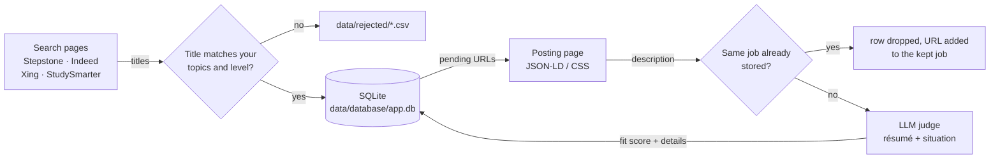

# Multi-Source Job Aggregator 

Searches several German job boards in one run, keeps the postings whose titles match your topics, reads every matching posting once, and lets an LLM of your choice judge it against your résumé and your situation. Everything lands in one local SQLite database, ranked by fit and with the key facts of every posting extracted. Between weekly runs only new postings are scraped and judged.



### The problems it solves
- No need to repeat the same searches on different job boards. Edit the config once and let the project do the job-board hopping for you.
- No need to try every synonym by hand (Python Entwickler, Python Developer, Python Software Developer, …). List the phrasings once; the embedding match collapses them.
- No need to open every posting. Each description is scraped once, judged once against your résumé and remembered, so a weekly run only processes what is new.
- The judge also extracts requirements, tech stack, responsibilities and logistics from each posting, so other tools can work with the database without re-reading the full posting.

## Sources

| Source | Type |
|--------|------|
| Stepstone | Playwright browser scraper |
| Indeed (`de.indeed.com`) | Playwright browser scraper |
| Xing Jobs | Playwright browser scraper |
| StudySmarter Talents (student jobs) | Playwright browser scraper |

Each scraper can be switched on or off with the `use_<site>_scraper` knobs in `src/config/scraper_common_config.py`.

## How a run works

**Stage 1 – title search**

1. For every enabled site, `location tiles × search keywords` search URLs are built, shuffled and visited one by one in a persistent Google Chrome profile (real Chrome, cookies kept between runs, human-like random delays and scrolling).
2. Only the first results page of each query is read. Every job title on it is cleaned (employment type, gender tags and contract words stripped), embedded with `BAAI/bge-m3` and compared against the `match_keywords` vocabulary — this measures the *topic*. A title is accepted when its score reaches `embedding_match_config.threshold` **and**, if `title_required_words` is set, it contains one of those words — this checks the *level* (e.g. Werkstudent / Praktikum / Thesis), which the topic score cannot see. Everything else goes to `data/rejected/` so you can tune both.
3. Accepted jobs are stored in `data/database/app.db`: title, URL (stored once), platform, title score, and the date the job was added. A URL that is already in the database — as a job or as a folded duplicate — is not added again.

**Stage 2 – description, de-duplication and judge**

4. For every stored job without a description (best title score first, at most `max_detail_pages_per_platform` per site and run) the posting page is opened in the same Chrome profile. Company, location, employment type, posting date and description come from the page's `JobPosting` JSON-LD block, with CSS selectors as fallback. Expired postings are marked and skipped; every page is saved immediately.
5. **De-duplication.** Title and company are stored exactly as the posting writes them; the location is stored normalised (lowercase, postcodes removed). For matching, title and company are normalised too (lowercase, gender tags such as "(m/w/d)", legal forms such as "GmbH & Co. KG" and "Deutschland" dropped), giving a readable key such as `io consultants|werkstudent data analytics simulation|heidelberg`. A posting is the same job as a stored one when
   - the key is identical (the same job re-posted, or posted on two boards under the same title), or
   - the company matches and the two descriptions are near-identical (word 5-gram similarity ≥ `dedup.description_similarity`, default 0.70) — this catches copies whose title wording or city order differs, while different jobs of the same company (which share boilerplate) stay apart.

   A duplicate is not stored: its row is dropped and its URL is added to the kept job's `other_urls`, so it is never scraped again and you can see every board the job is posted on.
6. Each remaining description is sent to the LLM configured in `.env` (any OpenAI-compatible endpoint: OpenRouter, Groq, OpenAI, Anthropic, …) together with your judge prompt and résumé from `profile/`. The model returns a JSON verdict — validated against a schema — with a fit score 0–100, the employment type, whether the level fits you, required languages, matched skills, missing must-haves, a short reason and the extracted details. Every job is judged once.
7. The log ends with a **run summary** (what this run did, how many jobs each search keyword and location found — and how many no other one found —, the best jobs it judged) and a **database summary** (totals, fit-score buckets, the best jobs overall).

Safety valves: a single failing query or page is skipped, not fatal; a site that starts blocking (CAPTCHA / "access denied" page, or several failures in a row) trips a circuit breaker that aborts *that* scraper and keeps what it had collected; a posting page that fails twice is left alone until it shows up in a search again; the judge stops on a bad API key or model name and after several failed calls in a row; `Ctrl-C` keeps everything saved so far.

## Quick start

Requirements: Python 3.12+ and Google Chrome (Playwright drives your installed Chrome, no `playwright install` needed).

```bash
python -m venv .venv
source .venv/bin/activate          # Windows: .venv\Scripts\activate
pip install -r requirements.txt
```

1. **Browser profile.** Set `browser_profile_path` in `src/config/scraper_common_config.py` to a directory Chrome may use as its profile. Open the job sites once in that profile and accept their cookie banners; a warmed-up profile is what keeps the anti-bot checks quiet. Close that Chrome before running the pipeline.
2. **Your profile for the judge.** Copy the two templates and adapt them:
   ```bash
   cp profile/system_prompt.example.md profile/system_prompt.md
   cp profile/resume.example.md profile/resume.md
   ```
   Both copies are gitignored. See [Adapting the project to you](#adapting-the-project-to-you).
3. **LLM endpoint.** Create `.env` in the repo root (copy `.env.example`):
   ```
   LLM_BASE_URL=https://openrouter.ai/api/v1   # or https://api.groq.com/openai/v1, https://api.openai.com/v1, ...
   LLM_API_KEY=...
   LLM_MODEL=...                                # the provider's model id
   ```
   Switching providers means changing these three lines, nothing else.
4. **Run.**
   ```bash
   python src/main.py
   ```

The first run downloads the embedding model (~2 GB). A full stage-1 run over all four sites is ~300 queries, roughly 50 minutes with the default throttling; stage 2 adds about 10 s per new posting.

`run_stage_1` / `run_stage_2` in `src/config/scraper_common_config.py` switch either stage off; stage 2 alone scrapes and judges whatever is still pending. To run a single scraper (stage 1 then stage 2 for that site, without the judge) or only the judge pass:

```bash
PYTHONPATH=src python src/sources/stepstone_scraper.py    # Windows: set PYTHONPATH=src
PYTHONPATH=src python src/utils/llm_judge.py
```

`src/` is the import root; in PyCharm, mark `src` as *Sources Root* once and every run configuration works.

## Scaling up safely

Job boards notice sudden bursts of traffic, so grow the search in steps:

1. Start with all `search_keywords` and one location per site (the default).
2. After a run or two, check the keyword yield in the run summary. A keyword whose second number stays at 0 only finds jobs other keywords find as well — drop it.
3. Then add the location tiles marked `step 2` in each `src/config/<site>_scraper_config.py`, and check the location yield the same way.

## Adapting the project to you

Nothing about your situation is hard-coded. These are the places to change:

| What | Where |
|------|-------|
| Who you are and what you look for (student / graduate / experienced, role types, seniority, languages, hours, what does *not* fit) and how postings are scored | `profile/system_prompt.md` — the *Candidate situation* section and the *fit_score guide*. Keep the *Output* section's keys unchanged; the reply is validated against them |
| Your résumé | `profile/resume.md` (plain text or markdown — you control exactly what the judge sees) |
| What is searched on the sites | `search_keywords` in `src/config/scraper_common_config.py` — keep it short, every entry costs one page load per location tile |
| What titles are scored against | `match_keywords` in the same file — never sent to a site, so it can be broad (niche phrasings, other languages) |
| Which job levels are accepted at all | `title_required_words` in the same file — a title must contain one of these whole words (e.g. werkstudent, praktikum, internship, thesis for students; junior, senior, … for others). `[]` switches it off |
| Which words are ignored when comparing titles | `EMPLOYMENT_NOISE_WORDS` (Werkstudent, Praktikum, Intern, …), `CONTRACT_NOISE_WORDS` and `GENDER_NOISE_WORDS` in `src/utils/util.py`. Because employment words are stripped, "Werkstudent Data Science" and "Data Science" embed identically — put topics, not employment types, into `match_keywords`; let the judge decide the level |
| Where | `location_radius_pairs` in each `src/config/<site>_scraper_config.py` (non-overlapping tiles; allowed radii are listed in each file) |
| How fresh | `job_age` in each site config (weekly and catch-up values are in each file's comment) |
| Which boards | `use_<site>_scraper` in `src/config/scraper_common_config.py` (StudySmarter only lists student jobs) |
| How strict the title filter is | `embedding_match_config.threshold` — see [Tuning](#tuning) |

## Configuration reference

`src/config/scraper_common_config.py` (shared by all scrapers):

| Key | Meaning |
|-----|---------|
| `use_<site>_scraper` | enable / disable a source (both stages) |
| `run_stage_1`, `run_stage_2` | run the title search / the description + judge stage |
| `log_level` | `DEBUG`, `INFO`, `WARNING`, … for the console and the log file (browser page errors and failed tracker requests only show at `DEBUG`) |
| `browser_profile_path` | persistent Chrome profile directory |
| `search_keywords`, `match_keywords`, `title_required_words` | see [Adapting the project to you](#adapting-the-project-to-you) |
| `embedding_match_config` | sentence-embedding model and the acceptance `threshold` |
| `throttle_config` | random delay ranges between queries, interactions, page loads and sources, plus scroll behaviour |
| `circuit_breaker.max_consecutive_failures` | failed queries or pages in a row before a scraper aborts |

`src/config/<site>_scraper_config.py` (one per site):

| Key | Meaning |
|-----|---------|
| `BASE_URL` | search URL template |
| `location_radius_pairs` | location tiles to query; with page 1 only, overlapping circles return the same page again |
| `job_age` | posting age filter |
| `use_headless_mode` | keep `False` for Indeed, Xing and Stepstone – they block headless browsers |
| `cookie_button` | cookie-banner button clicked when visible (`None` = no handling) |
| `search_page` | selectors for the results page (stage 1) |
| `detail_page` | selectors and expired-page phrases for the posting page (stage 2); `description` / `company` / `location` are fallback lists, first match wins |

`src/config/stage2_config.py`:

| Key | Meaning |
|-----|---------|
| `system_prompt_path`, `resume_path` | the judge's prompt and your résumé (default `profile/system_prompt.md`, `profile/resume.md`) |
| `max_detail_pages_per_platform` | posting pages per site and run; the rest stay pending for the next run |
| `max_description_attempts` | failed page loads before a URL is given up on |
| `max_description_chars` | longer descriptions are cut before judging |
| `throttle.between_detail_pages` | random delay between posting pages |
| `dedup.description_similarity` | how similar two descriptions of the same company must be to count as one job (0–1; raise it if different jobs get merged) |
| `llm.temperature`, `llm.max_tokens` | request parameters; `None` omits one (some reasoning models reject `temperature`) |
| `llm.response_format` | `"json_schema"` (the provider enforces the verdict schema), `"json_object"` or `None` for providers that reject the stricter modes; the reply is validated either way |
| `llm.timeout_seconds`, `llm.max_consecutive_failures`, `llm.delay_between_calls` | judge pass safety valves |
| `llm.rate_limit_retries`, `llm.rate_limit_pause_seconds` | on HTTP 429 (rate limit) the judge waits and retries the same job instead of failing it |

`.env`: `LLM_BASE_URL`, `LLM_API_KEY`, `LLM_MODEL`.

## Output

| Where | Content |
|-------|---------|
| `data/database/app.db` | **the result**: one row per job, see below |
| log (`logs/<timestamp>.log` and the console) | everything that happened, ending with the run summary and the database summary; log files are kept 15 days |
| `data/raw/<source>_jobs_<timestamp>.csv` | accepted titles of that source in this run, with score and closest keyword |
| `data/rejected/<source>_rejected_<timestamp>.csv` | rejected titles: a score below the threshold means "off topic", a score at or above it means "no required title word"; an empty title means the card could not be read — use these to tune the threshold and the word lists |
| `data/raw/<source>_descriptions_<timestamp>.csv` | posting pages visited in this run: status (`duplicate` rows show `original_id` and why they matched — they are not in the database), extraction path (`json_ld` / `css`), company, location, de-duplication key, description length |

A CSV with no rows is not written.

### The `jobs` table

| Column | Content |
|--------|---------|
| `id` | primary key |
| `url` | posting URL (tracking parameters removed); unique |
| `other_urls` | JSON list of the URLs of duplicates folded into this job (other boards, re-posts) |
| `platform` | `stepstone`, `indeed`, `xing`, `study_smarter` |
| `company` | exactly as the posting writes it, e.g. `io-consultants GmbH & Co. KG` |
| `title` | exactly as the posting writes it, e.g. `Werkstudent Data Analytics / Simulation (m/w/d)` |
| `location` | normalised: lowercase, postcodes dropped |
| `title_score` | stage-1 similarity to the closest `match_keywords` entry |
| `date_added` | date the job entered the database (`YYYY-MM-DD`) |
| `employment_type`, `date_posted` | from the posting's metadata (`date_posted` as `YYYY-MM-DD`) |
| `description`, `description_source` | posting text and where it came from (`json_ld` / `css`) |
| `description_status` | `pending` → `ok`, or `expired`, `failed` |
| `description_attempts` | page loads so far |
| `dedup_key` | `normalised company\|title\|first city` |
| `judge_model`, `fit_score`, `judge_json` | the verdict |

`judge_json` holds:

```json
{
  "fit_score": 88, "employment_type": "working_student", "level_ok": true,
  "required_languages": [{"language": "German", "level": "fluent"}],
  "matched_skills": ["Python", "SQL"], "missing_must_haves": ["Power BI"],
  "reason": "…",
  "details": {
    "requirements": {"must_have": [], "nice_to_have": [], "tech_stack": [], "keywords": []},
    "role": {"responsibilities": [], "team": "", "company_summary": ""},
    "logistics": {"start_date": "", "duration": "", "hours_per_week": "", "work_model": "hybrid", "salary": "", "application_deadline": ""}
  }
}
```

Reading it from another project:

```sql
SELECT id, title, company, url, fit_score,
       json_extract(judge_json, '$.details.requirements.must_have') AS must_have,
       json_extract(judge_json, '$.details.requirements.keywords') AS keywords
FROM jobs
WHERE description_status = 'ok' AND fit_score >= 70 AND json_extract(judge_json, '$.level_ok') = 1
ORDER BY date_added DESC, fit_score DESC;
```

To have a job judged again (e.g. after changing the prompt), set its `judge_model` to `NULL` and run stage 2. If two different jobs were merged, raise `dedup.description_similarity` and remove the wrongly folded URL from the kept job's `other_urls`; the next run picks it up again.

## Tuning

**Title threshold.** Stage 1 is a cheap pre-filter: recall matters more than precision, because a false positive only costs one page load and one judge call, while a false negative loses the job. After a run, sort `data/rejected/*.csv` by `title_score`. If relevant titles sit below the threshold, lower it to just under the lowest relevant one; the run summary shows what that costs in extra pages and judge calls. Improving `match_keywords` (more topic phrasings) usually helps more than moving the threshold. The default 0.43 comes from the first runs: every job the judge rated 60+ scored above 0.50, and relevant titles that were rejected went down to 0.434.

**Level words.** The topic score cannot tell "Werkstudent Data Engineering" from "Senior Data Engineer" — employment words are stripped before comparing. `title_required_words` does that job: in the first runs, every accepted title without a student word was rated 20 or lower by the judge. Rejected rows whose score is above the threshold were dropped by this list; if one of them should have passed, add its word.

**Fit-score cut-off.** After two or three runs, read the `reason` of jobs scoring around 50–75 and pick the score above which you would apply to most of them — or simply take the top N per week that you have time for. Filter on `level_ok` as well (see the SQL above). Check the cut-off again whenever you change the score guide in `profile/system_prompt.md`.

## Troubleshooting

- **The browser hangs at start or fails on the profile lock** — another Chrome still uses the profile directory; close it completely.
- **A site's circuit breaker trips** — the site is blocking. Raise the delays in `throttle_config` / `throttle.between_detail_pages`, or run that site less often.
- **The judge fails with HTTP 400 about the response format** — the provider or model does not support JSON schemas; set `llm.response_format` to `"json_object"` (or `None`).
- **"response cut off at max_tokens"** — reasoning models spend tokens on thinking; raise `llm.max_tokens`.
- **Frequent "Rate limit hit" pauses** — the provider's tokens-per-minute limit is reached. Every call counts its prompt (instructions + résumé + description) plus `llm.max_tokens`, so a shorter résumé, a lower `max_description_chars` or a lower `max_tokens` (if replies stay below it) all help; so does a paid tier.
- **"has schema version N, this code expects M"** — the database layout changed; move the old `data/database/app.db` aside and a fresh one is created on the next run.
- **Need more detail** — set `log_level` to `"DEBUG"` (shows throttling, browser page errors, failed requests, token usage).

## Roadmap

- Track application status per job.
- Wire "newest first" sorting for Xing, Stepstone and StudySmarter (Indeed already sorts by date), and add per-query yield logging to find saturated or useless queries.
- Pagination, if page 1 turns out to be too little.
- More sources (e.g. job APIs).

> **Project Status:** work in progress — ongoing development.
