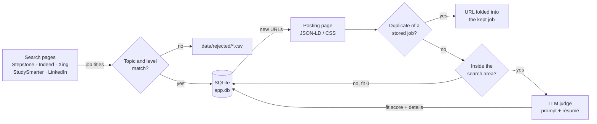

# Multi-Source Job Aggregator


**Searches five job boards for the German market in one run, keeps the postings that match your topics, reads each of them once, merges duplicates across boards and lets an LLM of your choice score every posting against your résumé.** The result is a local SQLite database of ranked, structured job postings; weekly runs only add and score what is new.

> **Kurzfassung (Deutsch)**
>
> Python-Pipeline, die fünf Jobbörsen für den deutschen Markt (Stepstone, Indeed, Xing, StudySmarter, LinkedIn) in einem Lauf durchsucht. Stellentitel werden mit einem mehrsprachigen Embedding-Modell (`BAAI/bge-m3`) nach Themen gefiltert, jede passende Anzeige wird einmal ausgelesen, Dubletten über Jobbörsen hinweg werden zusammengeführt, und ein frei wählbares LLM bewertet jede Anzeige anhand des Lebenslaufs – mit strukturierter, per Pydantic validierter JSON-Ausgabe. Ergebnis ist eine lokale SQLite-Datenbank, die bei jedem wöchentlichen Lauf nur um neue Anzeigen wächst.
>
> **Schwerpunkte:** Web-Automatisierung mit Playwright · NLP mit Sentence-Embeddings · LLM-Integration mit Schema-Validierung und Fallback-Modellen · Datenqualität (Normalisierung, Deduplizierung, Geo-Filter) · fehlertolerante Pipelines · datenbasierte Kalibrierung von Schwellenwerten

## The problem it solves

- The same searches on five boards every week, with every synonym ("Python Entwickler", "Python Developer", …) – configured once, run unattended.
- Hundreds of postings, most of them irrelevant – filtered by topic and level first, then read and scored against the résumé, so only the best ones need a human look.
- The same job on several boards, re-posted every few weeks – merged once and skipped from then on.

## Highlights

- **End-to-end pipeline, incremental by design.** Two stages around one SQLite store: search pages → title filter → database → posting pages → de-duplication → LLM verdict. Every page is saved the moment it is read, and only new postings cost a page load and an LLM call.
- **Resilient browser automation.** Playwright drives a real Google Chrome with a persistent profile, shuffled queries and randomised, human-paced delays. A failing query never stops the run; a per-site circuit breaker stops a scraper as soon as the site shows a block page or fails several times in a row, and keeps what it had collected.
- **Multilingual title matching.** Titles are cleaned with word-boundary regexes (gender tags such as "(m/w/d)", employment types, contract words) and embedded with `BAAI/bge-m3`, so "Werkstudent KI" and "Working Student AI" land on the same topic. Whole-word level and exclusion lists add the precision the topic score lacks.
- **Provider-agnostic LLM judge.** Any OpenAI-compatible endpoint, configured in `.env`. The verdict is a Pydantic model sent as a strict JSON schema and validated on return. An ordered fallback chain across models and providers switches on daily limits, waits as long as rate-limit responses ask and retries dropped connections; deterministic rules post-process every verdict.
- **Data quality.** Structured `JobPosting` JSON-LD first, CSS selectors as fallback; tracking parameters stripped from URLs; duplicates found by a normalised key or by word-5-gram containment of the descriptions; stale and removed postings detected; distances checked offline against GeoNames place data instead of being left to the LLM.
- **Observable.** Every run writes a log file ending in a run summary (yield per keyword and location, results per page, verdicts per model) and a database summary (totals, fit-score buckets, best jobs).

## Results

Real numbers from the runs in October 2026 (LinkedIn was added afterwards):

| Metric | Value |
|--------|-------|
| First full run | 1,038 job titles screened on four boards, 553 kept, 393 posting pages read, 123 postings judged – 3.6 hours, unattended |
| Jobs in the database | 426 unique postings (Xing 190, Stepstone 139, StudySmarter 67, Indeed 30) |
| Duplicates merged | 72 URLs folded into 59 kept jobs (re-posts and the same job on several boards) |
| Extraction | 98.6 % of descriptions from structured JSON-LD (416 of 422), the rest via CSS fallback |
| Postings scored | 392: 376 by three LLMs (`gpt-oss-120b`, `qwen3.8-27b`, `nemotron-3-super-120b`), 16 by the location filter without an LLM call |
| Fit scores | 76 strong matches (85–100), 65 good (60–84), 141 partial (30–59), 110 off target (0–29) |

## How it works



**Stage 1 – search and title filter.** For every enabled board, `location tiles × search keywords` URLs are built, shuffled and visited one by one; only the first results page is read. Each title is cleaned, embedded and compared with the `match_keywords` vocabulary, which measures the *topic*. A title is kept when its score reaches the threshold, it contains a level word from `title_required_words` (Werkstudent, Praktikum, Thesis, Junior, …) and none of `title_excluded_words` (sales, customer support, …). Kept jobs go into the database; rejected titles go to `data/rejected/` for tuning.

**Stage 2 – posting pages, de-duplication, judge.**

1. Every stored job without a description is opened once (best title score first, with a page budget per board and run). Company, location, posting date and description come from the page's `JobPosting` JSON-LD block, with CSS selectors as fallback (LinkedIn has no JSON-LD; its date comes from the "Vor 1 Woche" line). Board clutter such as apply buttons is removed. Removed postings, and postings older than 60 days that some boards keep listing for years, are marked expired and never judged.
2. A posting is the same job as a stored one when its key `company|title|first city` is identical (normalised: lowercase, gender tags and legal forms like "GmbH & Co. KG" dropped), or when the company matches and at least 90 % of the shorter description's word 5-grams appear in the other. A duplicate is not stored: its URL is added to the kept job's `other_urls`, so it is never visited again and every board a job is posted on stays visible.
3. Postings whose every town lies outside the search area (default: 100 km around Mannheim) and that are not remote get fit 0 without an LLM call. All others go to the LLM together with the judge prompt and the résumé from `profile/`. The verdict holds a fit score 0–100, the employment type, whether the level fits, required languages, matched skills, missing must-haves, a one-sentence reason and the extracted details (requirements, tech stack, role, company, logistics).
4. Two rules run in code afterwards: two or more missing must-haves cap the score at 84, and details are cleared below fit 40. When a model reaches its daily limit or is rejected, the next one takes over with the same job; a model that keeps failing is replaced as well. Whatever is left stays pending for the next run.

**Safety valves.** A failing query or page is skipped, not fatal. A site that starts blocking trips its circuit breaker; the other sites carry on. A posting page that fails twice is left alone until it shows up in a search again. The judge moves to the next model after a bad API key, a wrong model name or several failed calls in a row, and stops when none is left. `Ctrl-C` keeps everything saved so far, and the summaries are written even after a crash.

## Design decisions backed by data

- **Topic score and level words.** On the first 35 judged jobs, the title-embedding score barely predicted the LLM's fit (Spearman ρ ≈ 0.21), because employment words are stripped before embedding. A plain "title contains a student word" flag predicted it far better (ρ ≈ 0.79). Hence two cheap filters: a permissive topic threshold (0.40) for recall, and whole-word level and exclusion lists for precision.
- **A silent type bug.** `sqlite3` stored NumPy `float32` scores as 4-byte BLOBs, which made `ORDER BY title_score` close to random (434 of 1,035 pairs inverted). Fixed at the source and guarded by `CHECK (typeof(title_score) = 'real')`.
- **Containment instead of Jaccard for duplicates.** A 0.7 k-character teaser and the full 2.6 k-character ad of the same job had a Jaccard similarity of 0.28 but a containment of 1.00. On real data, true duplicates scored 0.98–1.00 and the closest different jobs of one employer 0.77, so the cut-off is 0.90.
- **Distances in code, not in the prompt.** The LLMs judged distances inconsistently: a town 174 km away scored 90, while one inside the radius was rejected as "outside". A GeoNames lookup now decides before the LLM is called – consistent results and fewer calls.
- **Token budgets measured, not guessed.** Free tiers count `max_tokens` against a tokens-per-minute limit, and reasoning needs differ by model (0.9 k to 4.4 k completion tokens for the same posting). Each model gets its own request settings, and the fallback chain spreads the daily load.
- **Word-boundary cleaning.** A naive `str.replace` of noise words turned "Design" into "desi" and "International" into "ational", corrupting the embeddings. Whole-word regexes fixed it.

## Tech stack

| Area | Tools |
|------|-------|
| Language | Python 3.12+ |
| Browser automation | Playwright with the installed Google Chrome, persistent profile |
| NLP | sentence-transformers, `BAAI/bge-m3`, NumPy |
| LLM | `openai` SDK against any OpenAI-compatible endpoint (Groq, OpenRouter, OpenAI, …), Pydantic v2 for the verdict schema |
| Storage | SQLite (`sqlite3`, JSON functions), versioned schema; pandas for the CSV diagnostics |
| Logging and config | loguru, python-dotenv |
| Geo data | GeoNames postal-code data (CC BY 4.0) |

## Sources

| Board | Notes |
|-------|-------|
| Stepstone | JSON-LD on every posting page; pauses and retries when the site drops the connection |
| Indeed (`de.indeed.com`) | sorted by date; its own short keyword list and a slower pace |
| Xing Jobs | JSON-LD; recognises removed ads in German and English |
| StudySmarter Talents | student jobs only; works headless |
| LinkedIn Jobs | public job pages without login; one large search circle and a small page budget per run |

Each board can be switched on or off with `use_<site>_scraper` in `src/config/scraper_common_config.py`.

## Project structure

```
src/
  main.py                   entry point: stage 1 → database → stage 2 → judge → summaries
  sources/                  one Playwright scraper per board (search pages and posting pages)
  config/                   shared knobs, one config per board (URL, tiles, selectors), stage-2 and LLM settings
  deduplication/
    normalize.py            title / company / location normalisation, de-duplication key
  utils/
    db.py                   SQLite store and schema
    llm_judge.py            Pydantic verdict schema, fallback chain, rate-limit handling
    detail_page.py          JSON-LD parsing, CSS fallbacks, expired-page check
    search_area.py          offline distance check against the place list
    util.py                 title cleaning, embeddings, URL normalisation, block-page detection
    throttle.py             human-like delays and scrolling
profile/                    judge prompt and résumé (only the *.example.md templates are tracked)
resources/places_de.csv     German place names with coordinates (GeoNames)
```

## Quick start

Requirements: Python 3.12+ and Google Chrome (Playwright drives the installed Chrome, no `playwright install` needed).

```bash
python -m venv .venv
source .venv/bin/activate          # Windows: .venv\Scripts\activate
pip install -r requirements.txt
```

1. **Browser profile.** Set `browser_profile_path` in `src/config/scraper_common_config.py` to a directory Chrome may use as its profile. Open the job sites once in that profile and accept their cookie banners, so the scraper starts from a normal returning browser. Stay logged out of LinkedIn in this profile: the scraper only reads public job pages. Close that Chrome before running the pipeline.
2. **Your profile for the judge.** Copy the two templates and adapt them:
   ```bash
   cp profile/system_prompt.example.md profile/system_prompt.md
   cp profile/resume.example.md profile/resume.md
   ```
   Both copies are gitignored. See [Adapting the project to you](#adapting-the-project-to-you).
3. **LLM endpoint.** Create `.env` in the repo root (copy `.env.example`):
   ```
   LLM_BASE_URL=https://openrouter.ai/api/v1   # or https://api.groq.com/openai/v1, https://api.openai.com/v1, ...
   LLM_API_KEY=...
   LLM_MODEL=...                                # the provider's model id; a comma list = fallbacks, tried in order
   ```
   Switching providers means changing these lines, nothing else. More providers can follow as numbered blocks, used once the models above are used up:
   ```
   LLM_2_BASE_URL=https://openrouter.ai/api/v1
   LLM_2_API_KEY=...
   LLM_2_MODEL=...
   ```
   Put the strongest model first: verdicts of different models are not equally strict. A model that needs other request settings (e.g. more `max_tokens` for long reasoning) gets an entry in `llm.per_model` in `src/config/stage2_config.py`; `.env` only says which endpoints and models to use. Free tiers receive your résumé with every prompt, so check the provider's data policy.
4. **Run.**
   ```bash
   python src/main.py
   ```

The first run downloads the embedding model (~2 GB). A full stage-1 run is 445 queries: 130 each on Stepstone, Xing and StudySmarter (10 location tiles × 13 keywords), 50 on Indeed and 5 on LinkedIn (their own shorter keyword lists, paced slowly) – roughly two hours with the default throttling. Stage 2 adds about 10 s per new posting (LinkedIn: at most 20 postings per run, 10–20 s apart).

`run_stage_1` / `run_stage_2` in `src/config/scraper_common_config.py` switch either stage off; stage 2 alone scrapes and judges whatever is still pending. To run a single scraper (stage 1 then stage 2 for that site, without the judge) or only the judge pass:

```bash
PYTHONPATH=src python src/sources/stepstone_scraper.py    # Windows: set PYTHONPATH=src
PYTHONPATH=src python src/utils/llm_judge.py
```

`src/` is the import root; in PyCharm, mark `src` as *Sources Root* once and every run configuration works.

## Adapting the project to you

Nothing about your situation is hard-coded. These are the places to change:

| What | Where |
|------|-------|
| Who you are and what you look for (student / graduate / experienced, role types, seniority, languages, hours, what does *not* fit) and how postings are scored | `profile/system_prompt.md` – the *Candidate situation* section and the *fit_score* guide. Keep the *Output* section's keys unchanged; the reply is validated against them |
| Your résumé | `profile/resume.md` (plain text or markdown – you control exactly what the judge sees) |
| What is searched on the sites | `search_keywords` in `src/config/scraper_common_config.py` – keep it short, every entry costs one page load per location tile. A site config can set its own shorter list (Indeed and LinkedIn do, they block quick bursts) |
| What titles are scored against | `match_keywords` in the same file – never sent to a site, so it can be broad (niche phrasings, other languages) |
| Which job levels are accepted at all | `title_required_words` in the same file – a title must contain one of these whole words (e.g. werkstudent, praktikum, internship, thesis for students; junior, senior, … for others). A trailing `*` also matches longer forms (`praktik*` → Praktikum, Praktikantin, Praktika), a leading `*` also matches compounds (`*buchhalt*` → Finanzbuchhaltung). `[]` switches it off |
| Which fields are never wanted | `title_excluded_words` – titles containing one of these words are rejected (e.g. sales, customer support, PhD, marketing, dual study). `[]` switches it off |
| Which words are ignored when comparing titles | `EMPLOYMENT_NOISE_WORDS` (Werkstudent, Praktikum, Intern, …), `CONTRACT_NOISE_WORDS` and `GENDER_NOISE_WORDS` in `src/utils/util.py`. Because employment words are stripped, "Werkstudent Data Science" and "Data Science" embed identically – put topics, not employment types, into `match_keywords` |
| Where | `location_radius_pairs` in each `src/config/<site>_scraper_config.py` (non-overlapping tiles; allowed radii are listed in each file) and `search_area` in `src/config/stage2_config.py` (centre and radius; postings outside are not judged) |
| How fresh | `job_age` in each site config (allowed values are in each file's comment) |
| Which boards | `use_<site>_scraper` in `src/config/scraper_common_config.py` (StudySmarter only lists student jobs) |
| How strict the title filter is | `embedding_match_config.threshold` – see [Tuning and scaling](#tuning-and-scaling) |

## Configuration reference

<details>
<summary><b>Shared settings</b> – <code>src/config/scraper_common_config.py</code></summary>

| Key | Meaning |
|-----|---------|
| `use_<site>_scraper` | enable / disable a source (both stages) |
| `run_stage_1`, `run_stage_2` | run the title search / the description + judge stage |
| `log_level` | `DEBUG`, `INFO`, `WARNING`, … for the console and the log file (browser page errors and failed tracker requests only show at `DEBUG`) |
| `browser_profile_path` | persistent Chrome profile directory |
| `search_keywords`, `match_keywords`, `title_required_words`, `title_excluded_words` | see [Adapting the project to you](#adapting-the-project-to-you) |
| `embedding_match_config` | sentence-embedding model and the acceptance `threshold` |
| `throttle_config` | random delay ranges between queries, interactions, page loads and sources, plus scroll behaviour |
| `circuit_breaker.max_consecutive_failures` | failed queries or pages in a row before a scraper aborts |

</details>

<details>
<summary><b>Per-site settings</b> – <code>src/config/&lt;site&gt;_scraper_config.py</code></summary>

| Key | Meaning |
|-----|---------|
| `BASE_URL` | search URL template |
| `location_radius_pairs` | location tiles to query; with page 1 only, overlapping circles return the same page again. Radii are in km, on LinkedIn in miles |
| `job_age` | posting age filter |
| `use_headless_mode` | keep `False` for Indeed, Xing, Stepstone and LinkedIn – they block headless browsers |
| `search_keywords`, `between_queries` | this site's own keyword list and delay between queries; `None` uses the common ones |
| `max_detail_pages`, `between_detail_pages` | this site's own number of posting pages per run and delay between them (stage 2); `None` uses `max_detail_pages_per_platform` and `throttle.between_detail_pages` from `stage2_config.py` |
| `cookie_button` | cookie-banner button clicked when visible (`None` = no handling); LinkedIn also has `modal_dismiss_button` for its sign-in popup |
| `search_page` | selectors for the results page (stage 1) |
| `detail_page` | selectors and expired-page phrases for the posting page (stage 2); `description` / `company` / `location` are fallback lists, first match wins |

</details>

<details>
<summary><b>Stage 2 and judge settings</b> – <code>src/config/stage2_config.py</code> and <code>.env</code></summary>

| Key | Meaning |
|-----|---------|
| `system_prompt_path`, `resume_path` | the judge's prompt and your résumé (default `profile/system_prompt.md`, `profile/resume.md`) |
| `max_detail_pages_per_platform` | posting pages per site and run (a site config's `max_detail_pages` overrides it); the rest stay pending for the next run |
| `max_description_attempts` | failed page loads before a URL is given up on |
| `max_description_chars` | longer descriptions are cut before judging (keeps prompt + `max_tokens` under a tokens-per-minute limit) |
| `throttle.between_detail_pages` | random delay between posting pages (a site config's `between_detail_pages` overrides it) |
| `throttle.after_connection_error` | pause before retrying a posting page once when the site drops the connection (Stepstone does this when it wants a break) |
| `search_area` | `latitude`, `longitude`, `radius_km` of the area you want; postings outside it are not judged (`None` turns the check off) |
| `verdict.empty_details_below`, `verdict.max_fit_with_missing_must_haves` | rules applied to every verdict (see stage 2, step 4) |
| `max_posting_age_days` | postings older than this (by their own posting date) are marked expired and not judged |
| `dedup.description_containment` | share of the shorter description that must appear in the other for two ads of the same company to count as one job (0–1; raise it if different jobs get merged) |
| `llm.temperature`, `llm.max_tokens` | request parameters, the defaults for every model; `None` omits one (some reasoning models reject `temperature`). Reasoning models need room: `gpt-oss-120b` uses ~2,350 completion tokens per verdict |
| `llm.response_format` | `"json_schema"` (the provider enforces the verdict schema), `"json_object"` or `None` for providers that reject the stricter modes; the reply is validated either way |
| `llm.per_model` | overrides of `temperature`, `max_tokens` and `response_format` for single models, keyed by the model name as written in `.env`, e.g. `{"nvidia/nemotron-3-super-120b-a12b:free": {"max_tokens": 12000}}`. An unknown key stops the judge pass with an error; an entry for a model that is not in `.env` is reported as a warning |
| `llm.timeout_seconds`, `llm.max_consecutive_failures`, `llm.delay_between_calls` | judge pass safety valves; the timeout must cover the slowest model's longest answer |
| `llm.connection_error_pause_seconds` | after a dropped connection the same call is retried once after this pause (a timeout is not retried) |
| `llm.rate_limit_retries`, `llm.rate_limit_pause_seconds` | on HTTP 429 (rate limit) the judge waits and retries the same job instead of failing it |
| `llm.rate_limit_max_wait_seconds` | a longer requested wait (or a message naming a daily limit) means the model is used up for today; the next model takes over |

`.env`: `LLM_BASE_URL`, `LLM_API_KEY`, `LLM_MODEL` (comma list allowed); further providers as `LLM_2_…`, `LLM_3_…`.

</details>

## Output

| Where | Content |
|-------|---------|
| `data/database/app.db` | **the result**: one row per job, see below |
| log (`logs/<timestamp>.log` and the console) | everything that happened, ending with the run summary and the database summary; log files are kept 15 days |
| `data/raw/<source>_jobs_<timestamp>.csv` | accepted titles of that source in this run, with score and closest keyword |
| `data/rejected/<source>_rejected_<timestamp>.csv` | rejected titles: a score below the threshold means "off topic", a score at or above it means the title has no required word or an excluded one; an empty title means the card could not be read – use these to tune the threshold and the word lists |
| `data/raw/<source>_descriptions_<timestamp>.csv` | posting pages visited in this run: status (`duplicate` rows show `original_id` and a `note` on why they matched – they are not in the database; stale postings say how old they are), extraction path (`json_ld` / `css`), company, location, de-duplication key, description length |

A CSV with no rows is not written.

<details>
<summary><b>The <code>jobs</code> table and the verdict JSON</b></summary>

| Column | Content |
|--------|---------|
| `id` | primary key |
| `url` | posting URL (tracking parameters removed); unique |
| `other_urls` | JSON list of the URLs of duplicates folded into this job (other boards, re-posts) |
| `platform` | `stepstone`, `indeed`, `xing`, `study_smarter`, `linkedin` |
| `company` | exactly as the posting writes it, e.g. `io-consultants GmbH & Co. KG` |
| `title` | exactly as the posting writes it, e.g. `Werkstudent Data Analytics / Simulation (m/w/d)` |
| `location` | normalised: lowercase, postcodes dropped |
| `title_score` | stage-1 similarity to the closest `match_keywords` entry |
| `date_added` | date the job entered the database (`YYYY-MM-DD`) |
| `employment_type` | the judge's classification (full_time, working_student, internship, …); empty until judged – the boards' own metadata is too unreliable |
| `date_posted` | the posting's own date (`YYYY-MM-DD`) |
| `description`, `description_source` | posting text and where it came from (`json_ld` / `css`) |
| `description_status` | `pending` → `ok`, or `expired` (removed, or older than `max_posting_age_days`), `failed` |
| `description_attempts` | page loads so far |
| `dedup_key` | `normalised company\|title\|first city` |
| `judge_model`, `fit_score`, `judge_json` | the verdict; `judge_model` is `location filter` for postings outside the search area |

`judge_json` holds:

```json
{
  "fit_score": 88, "employment_type": "working_student", "level_ok": true,
  "required_languages": [{"language": "German", "level": "fluent"}],
  "matched_skills": ["Python", "SQL"], "missing_must_haves": ["Power BI"],
  "reason": "…",
  "details": {
    "requirements": {"must_have": [], "nice_to_have": [], "tech_stack": [], "keywords": [], "education": [], "soft_skills": [], "experience": []},
    "role": {"responsibilities": [], "team": "", "company_summary": "", "projects": [], "learning": [], "prospects": ""},
    "company": {"industry": "", "products": [], "values": [], "size": "", "benefits": []},
    "logistics": {"start_date": "", "duration": "", "hours_per_week": "", "work_model": "hybrid", "salary": "", "application_deadline": ""}
  }
}
```

Example query:

```sql
SELECT id, title, company, url, fit_score,
       json_extract(judge_json, '$.details.requirements.must_have') AS must_have,
       json_extract(judge_json, '$.details.requirements.keywords') AS keywords
FROM jobs
WHERE description_status = 'ok' AND judge_model IS NOT NULL AND fit_score >= 70 AND json_extract(judge_json, '$.level_ok') = 1
ORDER BY date_added DESC, fit_score DESC;
```

To have a job judged again (e.g. after changing the prompt), set its `judge_model` to `NULL` and run stage 2; its old `fit_score` and `judge_json` stay until the new verdict replaces them, so filter on `judge_model IS NOT NULL` as above. If two different jobs were merged, raise `dedup.description_containment` and remove the wrongly folded URL from the kept job's `other_urls`; the next run picks it up again.

</details>

## Tuning and scaling

<details>
<summary><b>Scaling up safely</b></summary>

Job boards notice sudden bursts of traffic, so grow the search in steps:

1. Start with your `search_keywords` and one location per site with a generous radius.
2. After a run or two, check the keyword yield table in the run summary (accepted jobs per site, total, and how many no other keyword found). A keyword whose last number stays at 0 only finds jobs other keywords find as well – drop it.
3. Then cover the wider area with non-overlapping tiles. The default covers ten hubs within ~150 km of Mannheim (Mannheim, Darmstadt, Frankfurt, Mainz, Kaiserslautern, Karlsruhe, Heilbronn, Stuttgart, Saarbrücken, Würzburg); each radius is the largest allowed value that does not reach a neighbour's circle. `search_area` accepts postings within 100 km, so the farthest tiles (Saarbrücken, Würzburg) mostly feed jobs the location filter drops – trim them if you keep that radius.
4. Check "page 1 results per query" per site. Only page 1 is read, so if queries fill their first page, add a smaller location inside that circle (the commented entries in each `src/config/<site>_scraper_config.py`) for those searches; if they don't, more locations add nothing.

</details>

<details>
<summary><b>Title threshold, level words, fit-score cut-off</b></summary>

**Title threshold.** Stage 1 is a cheap pre-filter: recall matters more than precision, because a false positive only costs one page load and one judge call, while a false negative loses the job. After a run, sort `data/rejected/*.csv` by `title_score`. If relevant titles sit below the threshold, lower it to just under the lowest relevant one; the run summary shows what that costs in extra pages and judge calls. Improving `match_keywords` (more topic phrasings) usually helps more than moving the threshold. The default 0.40 comes from the first runs: the score barely predicts the judge's fit, and relevant titles went down to 0.41 – the word lists do the precision work.

**Level words.** The topic score cannot tell "Werkstudent Data Engineering" from "Senior Data Engineer" – employment words are stripped before comparing. `title_required_words` does that job: in the first runs, every accepted title without a student word was rated 20 or lower by the judge. Rejected rows whose score is above the threshold were dropped by this list or by `title_excluded_words`; if one of them should have passed, adjust the word lists.

**Fit-score cut-off.** After two or three runs, read the `reason` of jobs scoring around 50–75 and pick the score above which most jobs are worth a closer look – or simply take the top N per week. Filter on `level_ok` as well (see the example query). Check the cut-off again whenever you change the score guide in `profile/system_prompt.md`.

</details>

## Troubleshooting

<details>
<summary><b>Common problems and fixes</b></summary>

- **The browser hangs at start or fails on the profile lock** – another Chrome still uses the profile directory; close it completely.
- **A site's circuit breaker trips** – the site is blocking. Raise the delays in `throttle_config` / `throttle.between_detail_pages` (or that site's `between_queries`), give it a shorter `search_keywords` list, or run it less often.
- **"Security Check - Indeed.com"** – Indeed wants a human check. Open Chrome by hand on the scraping profile (see *Browser profile* under Quick start), open any Indeed page, pass the check, quit Chrome completely, then run again.
- **LinkedIn's sign-in page (`/authwall` in the URL)** – LinkedIn gives visitors who are not logged in only a few dozen page loads; the circuit breaker stops LinkedIn and the other sites carry on. Its pending postings are read by later runs (`max_detail_pages`, 20 per run), so running stage 2 daily works through them. Wait a few hours; do not log in to get around it.
- **The judge fails with HTTP 400 about the response format** – the provider or model does not support JSON schemas; set `"response_format": "json_object"` (or `None`) for that model in `llm.per_model`, or in `llm.response_format` for all.
- **"response cut off at max_tokens"** – reasoning models spend tokens on thinking; give that model more room in `llm.per_model` (Groq models must keep prompt + `max_tokens` under the 8k tokens-per-minute limit, other providers may not have such a limit).
- **"daily limit -- switching to …" / "every model is used up"** – free tiers cap tokens or requests per day (Groq: 200k tokens per model, roughly 30 judged jobs for `gpt-oss-120b`; OpenRouter free models: 50 requests per day in total). Add fallback models in `.env`; whatever stays pending is judged by the next run or by `python src/utils/llm_judge.py` the next day.
- **HTTP 400 "max completion tokens reached before generating a valid document"** – the model's reasoning plus the verdict did not fit its `max_tokens`; raise it for that model in `llm.per_model` (prompt + `max_tokens` must stay under the provider's tokens-per-minute limit, so lower `max_description_chars` if needed).
- **Frequent "Rate limit hit" waits** – the provider's tokens-per-minute limit is reached; the judge waits as long as the provider asks. Every call counts its prompt (instructions + résumé + description) plus `llm.max_tokens`, so a shorter résumé, a lower `max_description_chars` or a lower `max_tokens` (if replies stay below it) all help; so does a paid tier.
- **"has schema version N, this code expects M"** – the database layout changed; move the old `data/database/app.db` aside and a fresh one is created on the next run.
- **Need more detail** – set `log_level` to `"DEBUG"` (shows throttling, browser page errors, failed requests, token usage).

</details>

## Responsible use

The scrapers read only publicly visible pages, without logging in, one page at a time with randomised pauses, and they stop a site as soon as it shows a block page. Check each site's terms of use before running it; the project is meant for personal, non-commercial use, not for collecting or republishing data at scale. The résumé and the judge prompt stay local and gitignored; they are sent only to the LLM endpoint you configure.

## Roadmap

- Wire "newest first" sorting for Xing, Stepstone and StudySmarter (Indeed and LinkedIn already sort by date).
- Pagination, where page 1 turns out to be too little.
- More sources, e.g. the job search API of the Bundesagentur für Arbeit.

## Credits

Place coordinates for the search-area check: [GeoNames](https://www.geonames.org/) postal code data (`resources/places_de.csv`), licensed under [CC BY 4.0](https://creativecommons.org/licenses/by/4.0/).
